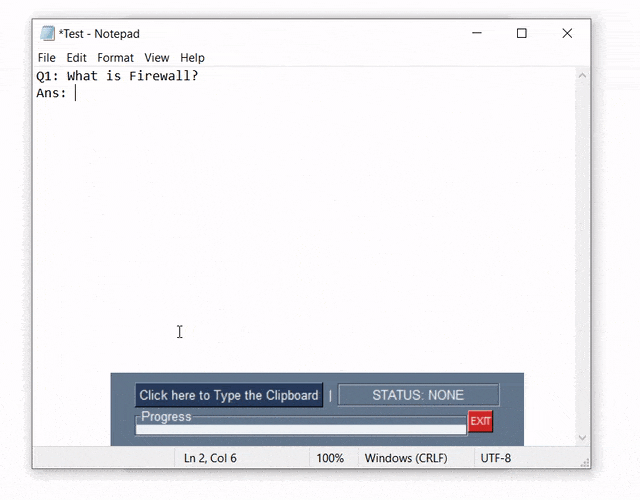

<h1 align="center">
  
</h1>
<p align="center">
    Type the contents stored in your Clipboard (instead of pasting them).
</p>
<p align="center">
<a href="#"></a>
<a href="LICENSE"></a>
</p>


## What does it do?
Types the content of your Clipboard rather than pasting it. I (might) use this to type in places that forbids pasting into them (exam portals, Code Editors, etc.). 

<p align="center"></p>


## How to run it?
- Python Compiler (3.7 Recommended). Currently works only on Windows.
- Necessary Python3 Libraries can be installed by running the following command:
  - ```bash
    pip install -r requirements.txt
    ```
- Run `main.py` and voila, start UnPasting.
  - There is a 5 seconds delay after pressing the "**Click here to Type the Clipboard**" to set the cursor in the right place.
  - ```
    python3 main.py
    ```


## Disclaimer
I shall not be liable for any consequential, incidental, direct, indirect, special, or other damages whatsoever (including, unlawful use, without limitation, damages for loss of business profits, business interruption, loss of business information, or other pecuniary loss).


<p align="center">
  Made with ❤️ by <a href="https://github.com/bearlike">Krishna Alagiri</a>
</p>


